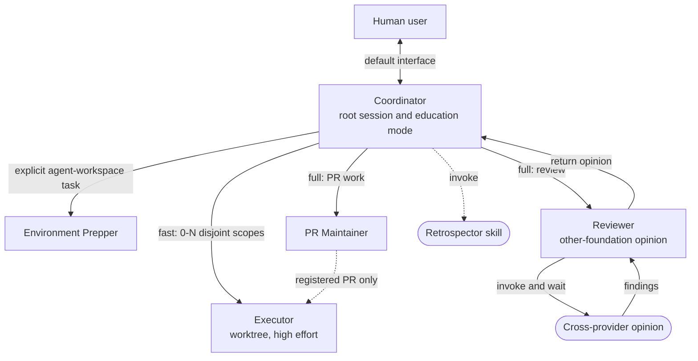

# harness-setup — portable AI coding-agent harness

A self-contained **global** AI coding-agent harness that can be installed for
any developer. It has these layers:

- **Tool-agnostic core — `~/AGENTS.md`.** How any agent should communicate and
  work with the human user: explanation style, word choice, execution
  conventions.
  `AGENTS.md` is a cross-tool convention, not a Claude Code feature — the
  guidance is about *how to work with the human user*, so any coding agent that reads
  `AGENTS.md` can use it. This is the portable heart of the setup.
- **Skills — `agent-skills/`.** Reusable, invokable procedures (a directory
  per skill holding `SKILL.md`). Claude Code and Codex CLI both use this same
  convention, so `install.sh` installs each skill into `~/.claude/skills/`
  always, and into `~/.agents/skills/` plus the legacy-compatible
  `~/.codex/skills/` whenever Codex CLI is already present.
- **External skills — `dependencies/external-skills.json`.** Skills maintained
  in another repository. The harness records an exact Git commit and content
  hash, resolves the files during deployment, and includes them in its release
  snapshot. Their `SKILL.md` files are not maintained in this repository.
- **Agent workflows — `agent-workflows/`.** Provider-neutral role prompts,
  topology, handoff contracts, model policies, and workflow procedures.
  Installation renders these into native Claude Markdown agents and Codex TOML
  agents, while keeping one readable source of truth.
- **Claude Code integration — `~/.claude/settings.json`, plugins.** Wires the
  core into Claude Code specifically: statusline, enabled plugins, and a
  `~/.claude/CLAUDE.md` symlink pointing at `~/AGENTS.md`.

Drop this onto a new device and run `install.sh` to restore the global setup.

## Filesystem agent tasks

The public CLIs perform task and workspace operations. Skills translate natural
language requests into these commands and retain only the human decisions that
cannot be scripted.

```bash
# General task
agent-task init --name "<name>" --objective "<text>" --destination "<parent>"
agent-task list -H
agent-task set-state --task-dir "<path>" --status waiting \
  --summary "<state>" --next-step "<resume trigger>" --format json

# Multi-repository workspace
agent-workspace init --name "<name>" --destination "<parent>" \
  --repo '<name>|<url>|<branch>|active'
agent-workspace rehydrate --manifest "<workspace.yaml>" --destination "<path>"
agent-workspace start-task --workspace "<path>" --name "<task>" --objective "<text>"
agent-workspace list-tasks --workspace "<path>" --status active -H
```

Use `--format json` when an agent or script consumes the result and `-H` for
terminal output. `reference` is the alternative repository role.
Workspace creation and rehydration register the workspace. Rehydration uses the
exact destination, verifies workspace metadata, repository origins, and primary
branches, then clones only missing repositories. Task creation only creates and
registers context. Use
`agent-task reconcile <root>...` only to import older folders or repair
registration after a manual copy or move.

Task folders and Git history remain authoritative. The SQLite catalog stores
this host's context paths. Stable task and workspace IDs keep
the relationship portable when another host uses a different absolute path.

Lifecycle changes require explicit intent and use `agent-task set-state` for
both general and workspace tasks. Runtime creation is separate. The
`task-session` compatibility skill sends runtime requests to `tss start`; a
disconnect or missing tmux process does not change task state. Execution notes
are created only for an explicitly selected agent-workspace task.

> Project-local skills and project `AGENTS.md` files are **not** included here;
> they belong in their respective project repositories.

## Quick start on a new device

```bash
git clone git@github.com:autumnust/harness-setup.git ~/Documents/harness-setup
cd ~/Documents/harness-setup
./install.sh
```

A normal local install resolves the external skills recorded in
[`dependencies/external-skills.json`](dependencies/external-skills.json), so it
needs Git and network access the first time. A later install can reuse the
resolved files from the current harness release when they verify against the
committed manifest. Remote broadcast resolves those skills on the source
machine and transfers them with the deployment copy. Restoring a harness
release uses the resolved files stored in that release and needs no network.

TSS is an optional companion dependency. It is not fetched by a normal
installation. To install the revision recorded in
[`dependencies/tss.json`](dependencies/tss.json), run:

```bash
./install.sh --with-tss
```

The installer stores the checked-out source at
`~/.agent-harness/dependencies/tss` and installs `tss` and `ts` in `~/bin`.
Use `./update.sh --with-tss` to refresh it to the revision currently recorded
by the harness. This requires Git and network access; an installation without
this option remains usable, but TSS runtimes cannot be started until TSS is
installed.

On a **fresh device** with no existing harness instructions, settings, skills,
workflow specs, or generated agents, this installs cleanly with no prompts.

To add a machine-specific paragraph to the deployed `~/AGENTS.md`, select a
profile once:

```bash
./install.sh --instance example-workstation
```

Profiles live in `instances/<name>.md`. Updates and rollback reuse the selected
profile; `--no-instance` returns the machine to the portable instructions only.

On a **device that already has global agent config**, `./install.sh` **refuses
to overwrite anything**. It lists every conflicting file and exits non-zero.
Pick one of:

```bash
./install.sh --backup         # Safest. Move each conflict to
                              #   <path>.bak.<timestamp> before installing.
./install.sh --overwrite      # Replace existing files outright. No backup.
./install.sh --skip-existing  # Keep existing files; only install missing ones.
./install.sh --update         # Steady-state sync: rewrite only files that
                              #   differ, diff + back up each first, no-op
                              #   when in sync. Use update.sh below instead.
```

### Prompt to paste into Claude Code on the new device

> Clone `git@github.com:autumnust/harness-setup.git` into `~/Documents/harness-setup`, then run
> `./install.sh` from inside it.
>
> If the script detects existing global agent config and exits
> with a conflict list, **ask me** which mode I want — `--backup`,
> `--overwrite`, or `--skip-existing` — before re-running. Do not
> choose for me.
>
> After the install succeeds, verify the enabled plugins listed in
> `~/.claude/settings.json` are installed by checking
> `~/.claude/plugins/installed_plugins.json`. Report anything that
> needed manual intervention.

## What gets installed

| Source in this repo | Target on the new machine |
|---|---|
| `home/AGENTS.md` | `~/AGENTS.md` (and tool-specific global-instruction symlinks for Claude and Codex) |
| `instances/<name>.md` | Appended to `~/AGENTS.md` only when that profile is selected |
| `claude/settings.json` | `~/.claude/settings.json` (with `node` path repatched) |
| `agent-skills/<name>/` | `~/.claude/skills/<name>/`; also `~/.agents/skills/<name>/` and `~/.codex/skills/<name>/` when Codex is present |
| revision-pinned entries in `dependencies/external-skills.json` | The same skill locations as portable skills; currently installs `unslop` from `cursor/plugins` |
| `agent-workflows/` | `~/.agent-harness/specs/` plus rendered `~/.claude/agents/agent-harness/*.md` and, when Codex is present, `~/.codex/agents/agent-harness-*.toml` |
| coordinator model and workflow depth | Codex Terra or Claude Code Sonnet plus medium effort; `agents.max_depth = 2` merged into Codex config |
| mutable runtime configuration | `~/.agent-harness/config.json` (initialized once, confirmed and maintained by the coordinator) |
| deterministic task commands | Stored under `~/.agent-harness/bin/` and linked into `~/bin/` as `agent-task`, `agent-workspace`, and `task-catalog` |
| versioned harness releases | `~/.agent-harness/releases/<release-id>/` with `~/.agent-harness/current` selecting the active release |
| machine-local task catalog | `~/.agent-harness/state/task-catalog/catalog.sqlite3` (initialized on first catalog command and never overwritten) |
| mutable learner state | `~/.agent-harness/state/learner-profiles/` (initialized once, never overwritten by updates or rollback) |

The catalog stores local context paths; task folders and Git remain
authoritative. Normal creation registers automatically. Use these commands only
for an imported or moved folder:

```bash
task-catalog register --path /path/to/task
task-catalog reconcile ~/Documents --format json
```

The installer uses `~/bin` for these command links, matching the existing TSS
installation. Add `~/bin` to `PATH` on a host that does not already include it.

Catalog listing uses one fixed, parameter-free SQL query. The CLI filters and
orders its result. Use `task-catalog list -H` for terminal output or
`--format json` for agents and scripts.

## Portable agent workflow

The main session is the coordinator. Fast is the default path: the
coordinator implements directly or fans out Executors. Education runs on
that path. Full-path prepper, review, and PR maintenance are escalation.
Nesting stops after two subagent levels.



Only the coordinator spawns agents, writes canonical state, or invokes the
`retrospector` skill. The Mermaid diagram is a summary; ordinary-work and
education behavior is defined in the
[Coordinator prompt](./agent-workflows/roles/coordinator.md). The shared
[PR-maintenance](./agent-workflows/workflows/pr-maintenance.md) and
[PR-review](./agent-workflows/workflows/pr-review.md) workflows define their
respective ordered processes.
The provider limit remains depth two as a defensive ceiling even though the
current topology uses only depth-one leaves. See
[`agent-workflows/`](./agent-workflows/) for the complete contracts and routing
rules and the [detailed topology](./agent-workflows/topology.md).

## What the settings.json controls

```jsonc
{
  "statusLine": { ... claude-hud node command ... },
  "enabledPlugins": {
    "claude-hud@claude-hud": true,
    "understand-anything@understand-anything": true,
    "frontend-design@claude-plugins-official": true,
    "crit@crit": true
  },
  "extraKnownMarketplaces": { ... github sources for each ... },
  "model": "sonnet",
  "effortLevel": "medium",
  "skipDangerousModePermissionPrompt": true,
  "agentPushNotifEnabled": true
}
```

Plugins are not vendored here. The marketplace entries tell Claude Code
where to fetch them on first launch — they auto-install into
`~/.claude/plugins/cache/` on the new device. The OpenAI Codex plugin supplies
the read-only adversarial-review runtime used by Reviewer in Claude Code
sessions.

The `unslop` skill is also not maintained as a copied source file here. Its
dependency entry identifies the upstream directory, approved commit, expected
content hash, and license. Installation copies the resolved upstream files into
the normal skill locations because Claude Code and Codex discover skills there.

## Idempotency

Re-running `install.sh` is safe: the default mode refuses conflicts, while
`--backup` and `--update` preserve replaced content as
`<path>.bak.<timestamp>`. Mutable state is never replaced.

Each successful install also preserves an immutable source snapshot. Repeating
an install with identical content reuses its release ID instead of creating a
duplicate.

```bash
~/.agent-harness/bin/harness-release list
~/.agent-harness/bin/harness-release current
~/.agent-harness/bin/harness-release rollback <release-id>
```

Rollback reruns the selected release's installer, then changes `current` after
that installation succeeds. Runtime configuration, learner profiles, PR
queues, and execution history remain outside release snapshots.

## What is deliberately not included

- `~/.claude/projects/`, `sessions/`, `tasks/`, `plans/`, `file-history/`,
  `telemetry/`, `cache/`, `backups/`, `paste-cache/`, `debug/`,
  `history.jsonl` — per-session state, not portable config.
- `~/.claude/plugins/cache/` — re-fetched from marketplaces.
- MCP server auth tokens for claude.ai-bridge integrations (Slack,
  Gmail, Notion, Figma, …) — those re-authenticate interactively on
  first use of each.
- Project-level `AGENTS.md` files and project `.claude/` directories.
- Mutable runtime configuration, learner profiles, PR queues, and execution
  history. The installer initializes local configuration and state directories
  but never checks their contents into this repository or overwrites them during
  updates.

## License

This project is licensed under the [MIT License](./LICENSE). The vendored
`frontend-slides` skill retains its own [MIT license](./agent-skills/frontend-slides/LICENSE).
The externally resolved `unslop` skill comes from
[`cursor/plugins`](https://github.com/cursor/plugins/tree/main/pstack/skills/unslop)
under its [MIT license](https://github.com/cursor/plugins/blob/main/pstack/LICENSE),
which the installer preserves beside the installed skill as `LICENSE.upstream`.

## Adding and refreshing external skills

For a GitHub-hosted skill, give the helper the same `blob` link to `SKILL.md` or
`tree` link to its directory that a user would paste into an agent:

```bash
python3 scripts/external-skills.py add-url \
  --manifest dependencies/external-skills.json \
  --url https://github.com/OWNER/REPOSITORY/blob/BRANCH/path/to/SKILL.md
```

The helper reads the skill name from `SKILL.md`, distinguishes a branch or tag
from the source path even when the ref name contains `/`, and also accepts an
exact 40-character commit permalink. It searches from the skill directory up
to the repository root for the nearest `LICENSE` or `COPYING` file, resolves
the selected ref to an exact commit, calculates the deployed content hash, and
writes the sorted manifest entry. Inspect the skill instructions and applicable
license before running it. If the applicable license has an unusual name or
location, add
`--license-path <repository-relative-path>`.

For another Git host or a repository layout the URL helper cannot interpret,
provide the inspected fields directly:

```bash
python3 scripts/external-skills.py add \
  --manifest dependencies/external-skills.json \
  --name <skill-name> \
  --repository <git-url> \
  --source-path <repository-path-to-skill> \
  --license-path <repository-path-to-license>
```

The field-based command reads the current `main` commit by default, verifies
that the selected directory contains a matching `SKILL.md`, computes the
content hash, and adds a sorted manifest entry. Use
`--tracking-ref refs/heads/<branch>` when the upstream skill follows another
branch. The installer, broadcaster, release manager, and scheduled updater
process every manifest entry; none of those paths contains skill-specific
names.

Review the new entry and upstream license before committing it. The source
repository remains responsible for the skill contents. The harness records
only retrieval and verification information.

The scheduled
[`refresh-external-skills.yml`](.github/workflows/refresh-external-skills.yml)
workflow checks the tracked upstream branch daily. It ignores upstream commits
that do not change the selected skill or its license. When those files change,
the workflow opens or updates a pull request containing the new commit and
content hash, plus links to the upstream comparison and resolved source.

Before committing, check the lock and deployment path:

```bash
python3 -m unittest tests.test_external_skills
python3 scripts/external-skills.py refresh-lock \
  --manifest dependencies/external-skills.json \
  --check
scripts/smoke-test-deployment.sh --offline
```

Exit status `3` means an upstream content change is available. To update the
lock intentionally, replace `--check` with `--write`, inspect the upstream
change, and commit the manifest update. Merging the lock change and running the
normal harness update or broadcast distributes the approved revision.

## Keeping a machine in sync after the repo changes (repo → `~/`)

The repo is the source of truth. After it changes — you edited `home/AGENTS.md`
and pushed, or you pulled someone else's commit — the live `~/` copy is stale,
because `install.sh` installs by **copying** (it won't silently overwrite). To
push the latest repo state onto the current machine:

```bash
cd ~/Documents/harness-setup
./update.sh            # git pull --ff-only, then install.sh --update
./update.sh --no-pull  # skip the pull (you just edited the repo locally)
```

`update.sh` only rewrites files that actually differ, prints a diff of each
change, backs up the prior copy to `<path>.bak.<timestamp>`, and is a no-op
when everything is already in sync. Restart active Claude Code and Codex
sessions afterward so they re-read the refreshed global config.

## Testing deployment without touching the live harness

On macOS, run the same fail-closed Seatbelt smoke test used by CI:

```bash
scripts/smoke-test-deployment.sh --offline
```

It installs into a temporary home, denies network and all writes outside that
temporary root, launches both real CLIs, verifies the rendered workflow and
update behavior, then cleans up. See
[`tests/deployment-smoke/README.md`](./tests/deployment-smoke/README.md) for the
coverage, containment boundary, CI trigger, and optional online awareness probe.

## Updating the repo from a source machine (`~/` → repo)

The other direction: you tweaked the live global config and want to capture it
back into the repo before committing.

```bash
cd ~/Documents/harness-setup
cp ~/AGENTS.md home/AGENTS.md
cp ~/.claude/settings.json claude/settings.json
rsync -a --delete --exclude='.git' ~/.claude/skills/ agent-skills/
git add -A && git commit -m "sync global config" && git push
```

Skills now deploy to three possible live locations (`~/.claude/skills/` and,
if Codex CLI is present, `~/.agents/skills/` and `~/.codex/skills/`). Prefer
editing `agent-skills/` in the repo directly and re-running `./update.sh`
rather than live-editing a deployed copy — if you do live-edit one, rsync from
*that* one back into `agent-skills/`, not several copies, or you risk
overwriting one tool's edits with another's.
