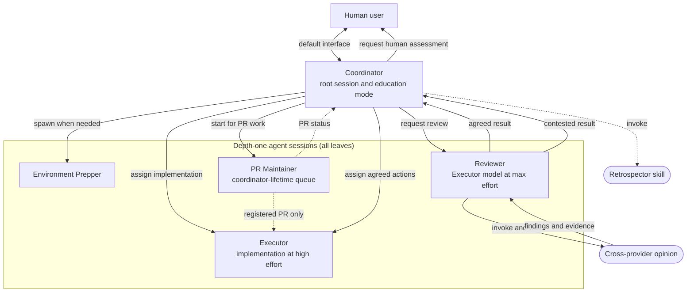

# harness-setup — portable AI coding-agent harness

A self-contained **global** AI coding-agent harness that can be installed for
any developer. It has these layers:

- **Tool-agnostic core — `~/AGENTS.md`.** How any agent should communicate and
  work with the human user: explanation style, word choice, execution
  conventions.
  `AGENTS.md` is a cross-tool convention, not a Claude Code feature — the
  guidance is about *how to work with the human user*, so any coding agent that reads
  `AGENTS.md` can use it. This is the portable heart of the setup.
- **Skills — `agent-skills/`.** Reusable, invokable procedures (a directory
  per skill holding `SKILL.md`). Claude Code and Codex CLI both use this same
  convention, so `install.sh` installs each skill into `~/.claude/skills/`
  always, and into `~/.agents/skills/` plus the legacy-compatible
  `~/.codex/skills/` whenever Codex CLI is already present.
- **Agent workflows — `agent-workflows/`.** Provider-neutral role prompts,
  topology, handoff contracts, model policies, and workflow procedures.
  Installation renders these into native Claude Markdown agents and Codex TOML
  agents, while keeping one readable source of truth.
- **Claude Code integration — `~/.claude/settings.json`, plugins.** Wires the
  core into Claude Code specifically: statusline, enabled plugins, and a
  `~/.claude/CLAUDE.md` symlink pointing at `~/AGENTS.md`.

Drop this onto a new device, run `install.sh`, and the global setup is restored
(plus a clone of `kumo-skills-catalog`).

> Project-local skills (`bench-ec2`, `gpu-ec2`, `learn`, `ship`, `cs224w`,
> `pdf`) and project `AGENTS.md` files are **not** included here — those
> live inside their respective project repos.

## Quick start on a new device

```bash
git clone git@github.com:autumnust/harness-setup.git ~/Documents/harness-setup
cd ~/Documents/harness-setup
./install.sh
```

On a **fresh device** with no existing harness instructions, settings, skills,
workflow specs, or generated agents, this installs cleanly with no prompts.

On a **device that already has global agent config**, `./install.sh` **refuses
to overwrite anything**. It lists every conflicting file and exits non-zero.
Pick one of:

```bash
./install.sh --backup         # Safest. Move each conflict to
                              #   <path>.bak.<timestamp> before installing.
./install.sh --overwrite      # Replace existing files outright. No backup.
./install.sh --skip-existing  # Keep existing files; only install missing ones.
./install.sh --update         # Steady-state sync: rewrite only files that
                              #   differ, diff + back up each first, no-op
                              #   when in sync. Use update.sh below instead.
```

### Prompt to paste into Claude Code on the new device

> Clone `git@github.com:autumnust/harness-setup.git` into `~/Documents/harness-setup`, then run
> `./install.sh` from inside it.
>
> If the script detects existing global agent config and exits
> with a conflict list, **ask me** which mode I want — `--backup`,
> `--overwrite`, or `--skip-existing` — before re-running. Do not
> choose for me.
>
> After the install succeeds, verify the enabled plugins listed in
> `~/.claude/settings.json` are installed by checking
> `~/.claude/plugins/installed_plugins.json`. Report anything that
> needed manual intervention.

## What gets installed

| Source in this repo | Target on the new machine |
|---|---|
| `home/AGENTS.md` | `~/AGENTS.md` (and tool-specific global-instruction symlinks for Claude and Codex) |
| `claude/settings.json` | `~/.claude/settings.json` (with `node` path repatched) |
| `agent-skills/<name>/` | `~/.claude/skills/<name>/`; also `~/.agents/skills/<name>/` and `~/.codex/skills/<name>/` when Codex is present |
| `agent-workflows/` | `~/.agent-harness/specs/` plus rendered `~/.claude/agents/agent-harness/*.md` and, when Codex is present, `~/.codex/agents/agent-harness-*.toml` |
| coordinator model and workflow depth | Provider fast model plus medium effort in Claude settings and Codex config; `agents.max_depth = 2` merged into Codex config |
| mutable runtime configuration | `~/.agent-harness/config.json` (initialized once, confirmed and maintained by the coordinator) |
| versioned harness releases | `~/.agent-harness/releases/<release-id>/` with `~/.agent-harness/current` selecting the active release |
| mutable learner state | `~/.agent-harness/state/learner-profiles/` (initialized once, never overwritten by updates or rollback) |
| *(cloned at install)* | `~/Documents/kumo-skills-catalog/` (from `kumo-ai/kumo-skills-catalog`) |

## Portable agent workflow

The main session is the coordinator. It owns interactive education and can
delegate environment preparation, implementation, review, PR maintenance, and
bounded teaching support while keeping user decisions and final synthesis in
the main context. Nesting stops after two subagent levels.



Only the coordinator spawns agents, writes canonical state, or invokes the
`retrospector` skill. The Mermaid diagram is a summary; ordered behavior is
defined only in the [default](./agent-workflows/workflows/default.md),
[education](./agent-workflows/workflows/education.md),
[PR-maintenance](./agent-workflows/workflows/pr-maintenance.md), and
[PR-review](./agent-workflows/workflows/pr-review.md) workflows.
The provider limit remains depth two as a defensive ceiling even though the
current topology uses only depth-one leaves. See
[`agent-workflows/`](./agent-workflows/) for the complete contracts and routing
rules and the [detailed topology](./agent-workflows/topology.md).

## What the settings.json controls

```jsonc
{
  "statusLine": { ... claude-hud node command ... },
  "enabledPlugins": {
    "claude-hud@claude-hud": true,
    "understand-anything@understand-anything": true,
    "frontend-design@claude-plugins-official": true,
    "crit@crit": true
  },
  "extraKnownMarketplaces": { ... github sources for each ... },
  "model": "sonnet",
  "effortLevel": "medium",
  "skipDangerousModePermissionPrompt": true,
  "agentPushNotifEnabled": true
}
```

Plugins are not vendored here. The marketplace entries tell Claude Code
where to fetch them on first launch — they auto-install into
`~/.claude/plugins/cache/` on the new device. The OpenAI Codex plugin supplies
the native review runtime used by Reviewer in Claude Code sessions.

## Idempotency

Re-running `install.sh` is safe: the default mode refuses conflicts, while
`--backup` and `--update` preserve replaced content as
`<path>.bak.<timestamp>`. Mutable state is never replaced.

Each successful install also preserves an immutable source snapshot. Repeating
an install with identical content reuses its release ID instead of creating a
duplicate.

```bash
~/.agent-harness/bin/harness-release list
~/.agent-harness/bin/harness-release current
~/.agent-harness/bin/harness-release rollback <release-id>
```

Rollback reruns the selected release's installer, then changes `current` after
that installation succeeds. Runtime configuration, learner profiles, PR
queues, and execution history remain outside release snapshots.

## What is deliberately not included

- `~/.claude/projects/`, `sessions/`, `tasks/`, `plans/`, `file-history/`,
  `telemetry/`, `cache/`, `backups/`, `paste-cache/`, `debug/`,
  `history.jsonl` — per-session state, not portable config.
- `~/.claude/plugins/cache/` — re-fetched from marketplaces.
- MCP server auth tokens for claude.ai-bridge integrations (Slack,
  Gmail, Notion, Figma, …) — those re-authenticate interactively on
  first use of each.
- Project-level `AGENTS.md` files and project `.claude/` directories.
- Mutable runtime configuration, learner profiles, PR queues, and execution
  history. The installer initializes local configuration and state directories
  but never checks their contents into this repository or overwrites them during
  updates.

## Keeping a machine in sync after the repo changes (repo → `~/`)

The repo is the source of truth. After it changes — you edited `home/AGENTS.md`
and pushed, or you pulled someone else's commit — the live `~/` copy is stale,
because `install.sh` installs by **copying** (it won't silently overwrite). To
push the latest repo state onto the current machine:

```bash
cd ~/Documents/harness-setup
./update.sh            # git pull --ff-only, then install.sh --update
./update.sh --no-pull  # skip the pull (you just edited the repo locally)
```

`update.sh` only rewrites files that actually differ, prints a diff of each
change, backs up the prior copy to `<path>.bak.<timestamp>`, and is a no-op
when everything is already in sync. Restart active Claude Code and Codex
sessions afterward so they re-read the refreshed global config.

## Testing deployment without touching the live harness

On macOS, run the same fail-closed Seatbelt smoke test used by CI:

```bash
scripts/smoke-test-deployment.sh --offline
```

It installs into a temporary home, denies network and all writes outside that
temporary root, launches both real CLIs, verifies the rendered workflow and
update behavior, then cleans up. See
[`tests/deployment-smoke/README.md`](./tests/deployment-smoke/README.md) for the
coverage, containment boundary, CI trigger, and optional online awareness probe.

## Updating the repo from a source machine (`~/` → repo)

The other direction: you tweaked the live global config and want to capture it
back into the repo before committing.

```bash
cd ~/Documents/harness-setup
cp ~/AGENTS.md home/AGENTS.md
cp ~/.claude/settings.json claude/settings.json
rsync -a --delete --exclude='.git' ~/.claude/skills/ agent-skills/
git add -A && git commit -m "sync global config" && git push
```

Skills now deploy to three possible live locations (`~/.claude/skills/` and,
if Codex CLI is present, `~/.agents/skills/` and `~/.codex/skills/`). Prefer
editing `agent-skills/` in the repo directly and re-running `./update.sh`
rather than live-editing a deployed copy — if you do live-edit one, rsync from
*that* one back into `agent-skills/`, not several copies, or you risk
overwriting one tool's edits with another's.
