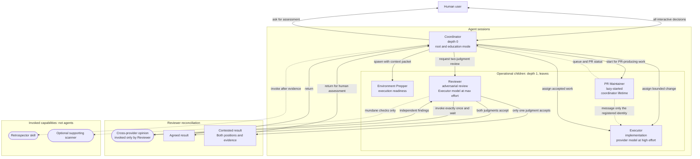

# Agent topology

The main session is always the coordinator and is the human user's sole
interface. It owns interactive education, spawning, decisions, canonical
state, and final synthesis. Every operational child is a leaf.

## Rules

1. All current children are depth-one leaves. Keep the provider limit at depth
   two as a defensive ceiling; it is not permission for a child to spawn.
2. Only Coordinator spawns agents. Retrospector and supporting scanners are
   invoked capabilities, not children.
3. Children normally message only Coordinator. The sole peer-message
   exception is PR maintainer to the exact executor identity registered for a
   queue item.
4. Children do not accept direct human turns. Coordinator remains the sole
   default human interface.
5. Diagram edge labels summarize behavior. The workflow files are
   authoritative for process order, lifecycle, and result routing.
